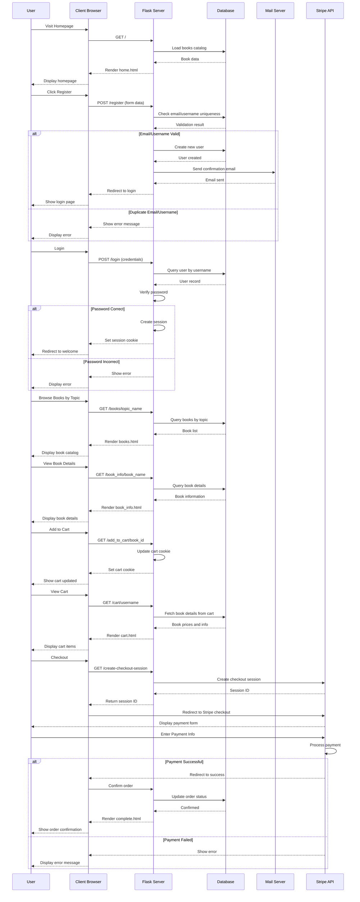

# Roy Bookstore

An e-commerce web application for browsing, purchasing, and managing a digital bookstore. Users can register, log in, browse books by category, add items to their cart, and complete purchases using Stripe payment integration.

## Purpose

Roy Bookstore is a full-featured online bookstore application that provides:
- **User Authentication**: Register, login, and password recovery functionality
- **Book Browsing**: Browse books by topic/category with detailed information
- **Shopping Cart**: Add/remove books from a persistent shopping cart
- **Secure Payments**: Stripe integration for safe payment processing
- **User Accounts**: Manage user profiles and purchase history

## Repository Contents

### Project Structure

```
roy_bookstore/
├── app.py                          # Application entry point
├── config.py                       # Configuration settings
├── application/
│   ├── __init__.py                # Flask app factory
│   ├── models.py                  # Database models (User, Book, Cart)
│   ├── forms.py                   # WTForms for validation
│   ├── bookinfo.py                # Book data/catalog
│   ├── main_routes.py             # Main pages & payment routes
│   ├── book_routes.py             # Book browsing & cart management
│   ├── login_routes.py            # Authentication routes
│   ├── static/
│   │   ├── navbar.css             # Navigation styling
│   │   └── main.js                # Client-side logic
│   └── templates/                 # HTML templates
│       ├── base.html              # Base template
│       ├── home.html              # Homepage
│       ├── books.html             # Books list page
│       ├── book_info.html         # Book detail page
│       ├── cart.html              # Shopping cart
│       ├── payment.html           # Checkout page
│       ├── login.html             # Login page
│       ├── register.html          # Registration page
│       ├── account.html           # User account page
│       ├── forgot.html            # Password recovery
│       ├── forgot_confirm.html    # Recovery confirmation
│       ├── welcome.html           # Welcome page (authenticated)
│       ├── complete.html          # Order completion page
│       └── 404error.html          # Error page
```

### Key Files

- **app.py**: Entry point that creates and runs the Flask application
- **config.py**: Configuration management for database, email, and Stripe settings
- **models.py**: Database models for User, Book, and Cart entities
- **main_routes.py**: Routes for homepage, 404 error handling, and Stripe payment processing
- **book_routes.py**: Routes for viewing books, book details, and cart management
- **login_routes.py**: Routes for user registration, login, logout, and password recovery

## Technologies Used

### Backend
- **Flask** - Lightweight Python web framework
- **Flask-SQLAlchemy** - ORM for database management
- **Flask-Login** - User session management
- **Flask-Mail** - Email functionality for account notifications

### Frontend
- **HTML/CSS** - Template rendering with Jinja2
- **JavaScript** - Client-side interactions
- **Bootstrap** (implied from templates) - Responsive design

### Database
- **SQLAlchemy** - SQL toolkit and ORM
- **SQLite/PostgreSQL** - Database (configurable via environment variables)

### Payment
- **Stripe API** - Secure payment processing

### Authentication & Security
- **Werkzeug** - Password hashing and security utilities
- **WTForms** - Form validation and CSRF protection

## Application Flow



## Setup & Installation

1. **Clone the repository**
   ```bash
   git clone <repository-url>
   cd roy_bookstore
   ```

2. **Create a virtual environment**
   ```bash
   python -m venv venv
   source venv/bin/activate  # On Windows: venv\Scripts\activate
   ```

3. **Install dependencies**
   ```bash
   pip install flask flask-sqlalchemy flask-login flask-mail python-dotenv stripe
   ```

4. **Configure environment variables** (create `.env` file)
   ```
   SECRET_KEY=your-secret-key
   FLASK_APP=app.py
   FLASK_ENV=development
   SQLALCHEMY_DATABASE_URI=sqlite:///books.db
   MAIL_SERVER=smtp.gmail.com
   MAIL_PORT=587
   MAIL_USERNAME=your-email@gmail.com
   MAIL_PASSWORD=your-app-password
   MAIL_USE_TLS=True
   STRIPE_SECRET_KEY=your-stripe-secret-key
   STRIPE_PUBLISHABLE_KEY=your-stripe-publishable-key
   ```

5. **Run the application**
   ```bash
   python app.py
   ```

6. **Access the application**
   ```
   http://127.0.0.1:5000/
   ```

## Features

- ✅ User registration and authentication
- ✅ Secure password storage
- ✅ Browse books by category
- ✅ View detailed book information
- ✅ Add/remove items from shopping cart
- ✅ Persistent cart using cookies
- ✅ Stripe payment integration
- ✅ Email notifications for registration
- ✅ Password recovery functionality
- ✅ Responsive web design